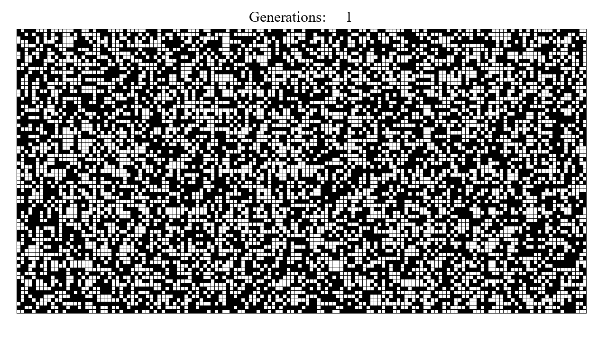

## GAME OF LIFE



### Description
Creating a [game of life](https://en.wikipedia.org/wiki/Conway%27s_Game_of_Life) for NumWorks calculators (N100 and N110) in python using [Kandinsky package](https://www.numworks.com/fr/ressources/python/activites/kandinsky/).

### Usage
There's a pc version available if you need it in the 'test pc vers' directory. 
About the NumWork version, you just need to use the command below :
```
start(generation,length,windth)
```
There are three sizes available: 16/10; 32/20; 40/25 

### Participation
Feel free to share your ideas about the project by [mail](poire.erwan2005@gmail.com) or do a little pull request or open an issue, I'll check ;)

